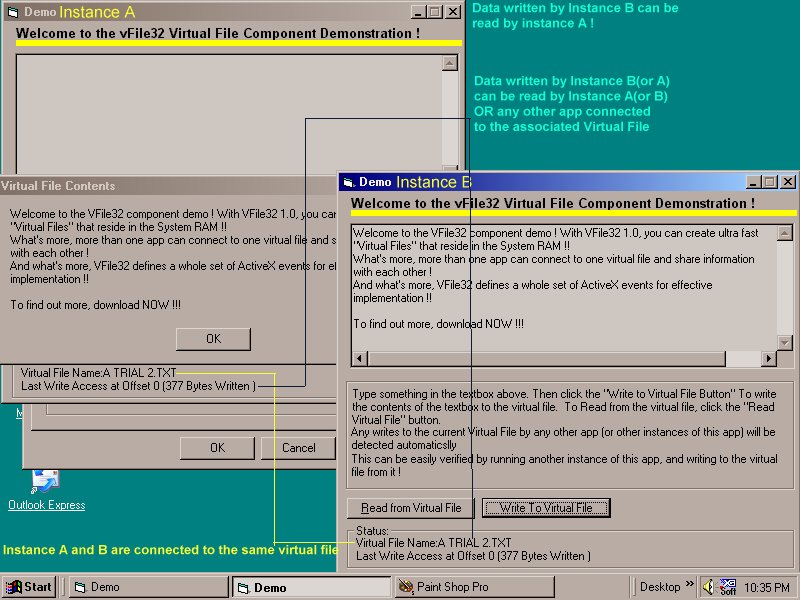



## Communicate and share data bet apps with Virtual RAM Files \(No RamDrives Needed\!\)

### Description

Create ultra fast virtual files that reside in the RAM (No need of slow harddrives !) that can be shared by more than one app at once... With VFile32, you can even communicate with "N" number of other apps connected to a particular virtual file.. With a host of ActiveX events, this power packed component will no doubt extend the VB environment and make interprocess communication and data sharing a LOT easier ! And of you found this code useful, your vote would be appreciated
 
### More Info
 

             |
---                |---
**Submitted On**   |2002-08-13 21:54:58
**By**             |[Srideep Prasad](https://github.com/Planet-Source-Code/PSCIndex/blob/master/ByAuthor/srideep-prasad.md)
**Level**          |Advanced
**User Rating**    |4.8 (203 globes from 42 users)
**Compatibility**  |VB 5\.0, VB 6\.0
**Category**       |[VB function enhancement](https://github.com/Planet-Source-Code/PSCIndex/blob/master/ByCategory/vb-function-enhancement__1-25.md)
**World**          |[Visual Basic](https://github.com/Planet-Source-Code/PSCIndex/blob/master/ByWorld/visual-basic.md)
**Archive File**   |[Communicat1176108132002\.zip](https://github.com/Planet-Source-Code/srideep-prasad-communicate-and-share-data-bet-apps-with-virtual-ram-files-no-ramdrives-nee__1-34324/archive/master.zip)

### Source Code

<<html>
<head>
<meta http-equiv="Content-Language" content="en-us">
<meta http-equiv="Content-Type" content="text/html; charset=windows-1252">
<meta name="GENERATOR" content="Microsoft FrontPage 4.0">
<meta name="ProgId" content="FrontPage.Editor.Document">
<title>New Page 1</title>
</head>
<body>

<b>The Concept of Virtual Files and Memory Sharing</b>

The origins of concept of Virtual Files and memory sharing can be traced back
to the old days of MS-DOS. MS-DOS used to provide a driver called RamDrive.Sys
that enabled the creation of "Virtual Drives" in the RAM wherein
"Virtual Files" could be created and stored. The virtual drive could
be used for the purpose of storing "vitual" temp files in the RAM
instead storing "real" temp files in the slow harddisk drive....

Also DOS provided no "memory protection". That is one program can
easily read or write to almost any region of memory. Thus it was very easy for a
badly coded app (or a virus) to bring down the system... Thus, at least in
theory, memory sharing and common memory addressing was possible ! A program
could actually write something to some area of memory and another program could
actually read from the very same memory address... But since MS-DOS is single
tasking, this kind of interaction between programs was possible only by writing
low level TSR/Device Driver programs that fiddle around with software Interrupts
and Memory... This kind of interaction was also possible only between 2 TSRs or
a TSR and a user program...

<b>Microsoft Windows, the 32-Bit Protected Mode Interface and Memory
Sharing...</b>

All processors, from the 80386 onwards support a new mode of operation, the
32-bit protected mode. Under this mode, the processor (with the help of a
protected mode OS such as Windows 9X/NT) can execute a number of programs
simultaneously in various "Virtual Machines". Each program runs its
own "Address space" and any attempt by any program to access areas of
memory that does not belong to it causes a "General protection fault"
that results in the termination of the program.... Thus, there is more
protection from "rogue" programs and the stability of the system
is greatly enhanced.... But it also means that memory sharing and "Virtual
Files" (which are basically areas of memory that can be accessed by more
than one app) are impossible, at least in theory....

<b>Memory Sharing in Windows 9X/NT and the inherent problems...</b>

Fortunately, Windows does make a few allowances. It allows sharing of memory
by the creation of what Microsoft calls "Named Memory Objects" using
the File Mapping APIs (located in Kernel32.dll). These APIs can be used to
allocate "named" areas of memory and applications can then map these
areas into their address space and read and write to these areas.Any changes made by one app are visible
to other apps as well....

But using "Named Memory Objects" for memory sharing is
cumbersome... There are no notification mechanisms and reading and writing to
memory directly involves use of pointers, normally not supported in VB. Also
(especially in Win9X/ME where the protected mode "memory protection"
is not implemented strictly), an app can easily write accidentally to some
critical system area of memory, and bring down your system, either immediately
or with the infamous Blue Screen of Death !

<b>Where VFile32 Comes In....</b>

VFile32 though internally relies on the File Mapping APIs to create
"Named memory Objects", it hides the complicated API interface, and
the memory addressing issues from the programmer. It also includes a host of
notification features including those that signal any exception or error conditions... And as
far as the programmer is concerned, he is no longer reading or writing to just
"Memory", he is read and writing to a "Virtual File" !

In other words, VFile32 allows the creation of "Virtual Files" in
the RAM. These files can be shared between any number of apps. Also a host of
notification features are provided to enable synchronization... For example, if
App A, App B and App C are using a virtual file "Trial.txt". If App A
were to write a string to the virtual file at some offset (say 0), both App B
and App C will be notified of this write operation.They would be signalled where
exactly the write operation took place, and what was the size of the data chunk
written.. They could then read the exact area of the "Virtual File"
instead of repeatedly reading the entire file to look for any changes...

Thus VFile32 facilitates effective and easy Virtual File Management, Memory
Sharing and Interprocess communication... 

With VFile32, you truly do a lot more things with a lot less effort !!!

<b>How Virtual Files are managed...</b>

VFile32, as said before, allocates areas of memory and exposes them to client
apps through a File like interface. But there are some major differences between
Virtual Files and Real Files...

A Virtual file is first created when a client app calls the
InitializeVirtualFile sub. The name (say "Trial.txt") and size of the
file are determined by the parameters passed to VFile32 by the client app. Once
initialized, a virtual file, unlike a "real" file cannot be resized by
any direct means.. (I could add support for this, but it would involve
compromising reliability and efficiency - Not to mention, a complete rewrite of
the code !) When a file is fist initialized, the OnVFileCreate event is fired...
Subsequent calls  to the InitializeVirtualFile sub by other apps(processes)
(with respect to the same virtual file, say "Trial.txt") will cause a
connection to the virtual file already created earlier to be established (In
this case the OnVFileCreate event will not fire !)... The Size parameter will be
ignored and the size of the associated virtual file will remain the same as when
it was first initialized...

When a process (app) has finished using a virtual file, it must call the
CleanUp method to "clean up" the Virtual File I/O interface. When no
more apps are using a particular virtual file (say "Trial.txt") the
virtual file is destroyed and the memory used by it is freed..When this happens,
the OnVFileDestroy event is fired...

Thus unlike a real file, a Virtual File (as implemented in VFile32) remains
"intact" only as long as client processes (apps) are using them. The
moment all client applications "disconnect" from a virtual file, the
virtual file is destroyed 

<b>Q & A...</b>

<i>Q1>Was VFile32 created entirely in VB ? But then VB doesn't support
pointers, does it ? 
ANS></i>Well, 95 % of VFile32 was created in VB. A small Memory Helper DLL,
with hardly 10 lines of code (MemHlp.dll) was written in  C++ though.. This
could not be avoided as VB does not provide any way to directly read or write to
some location of memory.. 

<i>Q2>What is MemHlp.dll all about ? 
ANS></i>MemHlp.DLL is nothing but a small helper dll. It defines two
functions (APIs), ReadMem() and WriteMem() that enable reading and writing to a
specific memory address, normally not possible in VB.

<i>Q3>Can I store anything in a Virtual File ? 
ANS></i>Yes - But as far as possible avoid storing NULL [Chr$(0)] characters
since VB has trouble handling NULLs when transfering strings containing NULLs
from the C++ DLL to the main VFile32.DLL component...

<i>Q4>Do I need to know anything about pointers, memory addresses and all
that sort of stuff ...  ? 
ANS></i>NO - You don't even need to know that a pointer is when using
VFile32. As long as you are concerned, you are writing and reading to a
"File" !

<i>Q5>Do Virtual Files really reside in the System RAM ? But won't they be
paged into the swap file ? 
ANS></i>As far as you are concerned, Virtual files reside in the RAM. Only
when the system runs out of memory, Windows may page part or whole of a Virtual
File into the swap file... But this will hardly happen, since Windows avoids
paging areas of memory being used/accessed often by apps as far as
possible,unless the system runs very low in memory...

<b>How to Maximise Performance of vFile32</b>

VFile32 is actually a component for interprocess communication, and enables
transparent event based interprocess communication (communication between apps)
and data sharing.. It must be strictly used for only this purpose as far as
possible...It also can be used to create Virtual Temp files as long as they are
not very big...Else it will result in increased memory utilization causing
increased swapping by Windows and slowdown..

Also do not recursively connect and disconnect from an existing virtual
file.. Connect once, and keep the connection open.. When you no longer need the
connection,close it !

<b>An After Word....</b>

Well, I do hope you find this piece of code useful and interesting... I would
welcome any suggestions and comments. Any ideas on improving it also are
welcome...

<u><b>And finally, if you do find this useful, your
vote would be really appreciated !</b> </u>

</body>
</html>

